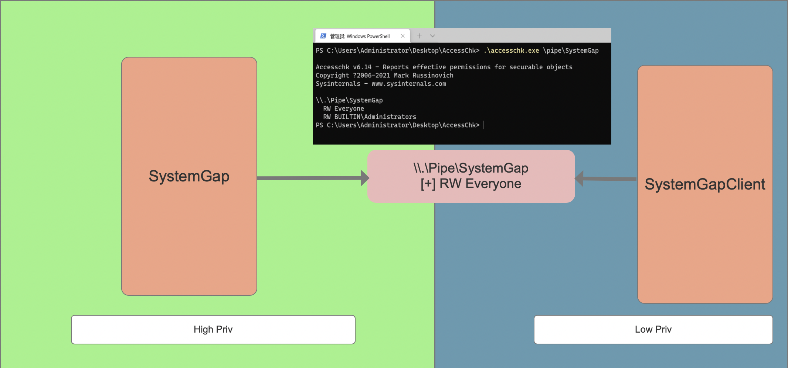

# SystemGap

适用于解决不稳定Windows漏洞提权成功后进行权限驻守的办法

## SystemGap - 监听者

SystemGap 负责监听一个任意用户可读写的匿名管道，从管道中读取命令进行执行

## SystemGapClient - 发送者

SystemGapClient 负责向匿名管道中传入指令

通过低权限的匿名管道传递命令，实现长久时间处于低权限的进程随时能够以高权限运行任意代码。

## 演示

## 解决以下问题

- 提权的时候第一次成功了，但是后续无法继续提权，因此可以使用SystemGap持续驻守高权限。

核心技术原理 ： Windows安全描述符、[Windows权限控制相关的防御与攻击技术](https://payloads.online/archivers/2021-01-31/1)

